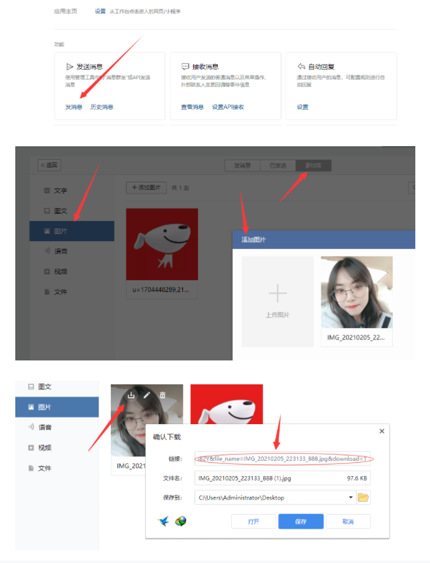

<div align="center">
<h1 align="center">
BILIBILI-HELPER
</h1>

[](https://github.com/JunzhouLiu/BILIBILI-HELPER-PRE/stargazers)
[](https://github.com/JunzhouLiu/BILIBILI-HELPER-PRE/network)
[](https://github.com/JunzhouLiu/BILIBILI-HELPER-PRE/issues)
[](https://github.com/JunzhouLiu/BILIBILI-HELPER-PRE/blob/main/LICENSE)
[](https://github.com/JunzhouLiu/BILIBILI-HELPER-PRE/releases)
[](https://hub.docker.com/r/superng6/bilibili-helper)
[](https://github.com/JunzhouLiu/BILIBILI-HELPER-PRE/releases)
[](https://hits.seeyoufarm.com)
[](https://app.fossa.com/projects/git%2Bgithub.com%2FJunzhouLiu%2FBILIBILI-HELPER-PRE?ref=badge_small)

</div>

## 工具简介

这是一个利用 Linux Crontab ,云函数， Docker 等方式实现哔哩哔哩（Bilibili）每日任务投币，点赞，分享视频，直播签到，银瓜子兑换硬币，漫画每日签到，简单配置即可每日轻松获取 65 经验值，快来和我一起成为 Lv6
吧\~\~\~\~

**如果觉得好用，顺手点个 Star 吧 ❤**

**仓库地址：[JunzhouLiu/BILIBILI-HELPER](https://github.com/JunzhouLiu/BILIBILI-HELPER-PRE)**

**B 站赛事预测已集成到本工具中，每天自动参与 KPL，LPL 赛事预测，赚取硬币。**

**请不要滥用相关 API，让我们一起爱护 B 站 ❤**

## 功能列表

- [x] 通过 docker 或者云函数执行定时任务。_【运行时间可自定义】_
- [x] 哔哩哔哩漫画每日自动签到，自动阅读 1 章节 。
- [x] 每日自动从热门视频中随机观看 1 个视频，分享一个视频。
- [x] 每日从热门视频中选取 5 个进行智能投币 _【如果投币不能获得经验了，则不会投币】_
- [x] 投币支持下次一定啦，可自定义每日投币数量。_【如果检测到你已经投过币了，则不会投币】_
- [x] 大会员月底使用快到期的 B 币券，给自己充电，一点也不会浪费哦，默认开启。_【已支持给指定 UP 充电】_
- [x] 大会员月初 1 号自动领取每月 5 张 B 币券和福利。
- [x] 每日哔哩哔哩直播自动签到，领取签到奖励。_【直播你可以不看，但是奖励咱们一定要领】_
- [x] 投币策略更新可配置投币喜好。_【可配置优先给关注的 up 投币】_
- [x] 自动送出即将过期的礼物。 _【默认开启，未更新到新版本的用户默认关闭】_
- [x] 支持推送执行结果到微信，钉钉，飞书等。
- [x] 支持赛事预测。_【支持反向预测】_

[点击快速开始使用](#使用说明)

[点击快速查看自定义功能配置](#自定义功能配置)

# 目录

- [目录](#目录)
  - [使用说明](#使用说明)
    - [获取执行所需的 cookies](#获取执行所需的-cookies)
    - [一、快速使用](#一快速使用)
    - [二、使用 Docker](#二使用-docker)
    - [三、使用 腾讯云函数](#三使用-腾讯云函数)
    - [四、使用 GitLab CI/CD](#四使用-gitlab-cicd)
    - [五、使用青龙管理面板](#五使用青龙管理面板)
  - [自定义功能配置](#自定义功能配置)
    - [配置文件参数](#配置文件参数)
  - [免责声明](#免责声明)
  - [API 参考列表](#api-参考列表)
  - [基于本项目的衍生项目](#基于本项目的衍生项目)
  - [致谢](#致谢)
  - [讨论群](#讨论群)
  - [License](#license)
  - [Stargazers over time](#stargazers-over-time)

## 使用说明

### 获取执行所需的 cookies

1. 浏览器打开并登录 [bilibili][1] 网站
2. 按 F12 打开 「开发者工具」 打开 网络/NetWork -> 找到并点击 nav 请求
3. 下拉请求详情，复制完整的 cookie 和 UA 备用。

ps:cookie 和 ua 只需要选中，右键复制值即可。


[1]: https://www.bilibili.com/

### 一、快速使用

1. 点击 [BILIBILI-HELPER/release][3]，下载已发布的版本，解压后压缩包内应该包含一个 jar 包和一份`config.json`文件。
2. 将获取的到的 cookie 字符串和 ua 字符串填写到 config.json 中的 `biliCookies`和`userAgent`字段值中。

[3]: https://github.com/JunzhouLiu/BILIBILI-HELPER-PRE/releases/latest

3. 在当前目录执行 `java -jar BILIBILI-HELPER.jar` 即可开始执行任务（需要保证`config.json`文件存在并且配置好了 ck 等）。

ps ：需要本地有 java8 执行环境。

### 二、使用 Docker

请自行参阅 [基于本项目的衍生项目](#基于本项目的衍生项目)。

- **基于本项目的 docker 封装项目：[SuperNG6/docker-bilibili-helper](https://github.com/SuperNG6/docker-bilibili-helper)**

- **基于本项目的 docker 镜像：[superng6/bilibili-helper](https://hub.docker.com/r/superng6/bilibili-helper)**

### 三、使用 腾讯云函数

请参考[腾讯云函数部署](docs/scf.md)

### 四、使用 GitLab CI/CD

请参考[GitLab CI/CD 部署](docs/gitlab.md)

### 五、使用青龙管理面板

请参考[青龙管理面板部署](docs/qinglong.md)

## 自定义功能配置

配置文件示例：

```json
{
  "biliVerify": {
    "biliCookies": "你的bilibili cookies"
  },
  "taskConfig": {
    "skipDailyTask": false,
    "matchGame": false,
    "showHandModel": false,
    "predictNumberOfCoins": 1,
    "minimumNumberOfCoins": 100,
    "taskIntervalTime": 20,
    "numberOfCoins": 5,
    "coinAddPriority": 1,
    "reserveCoins": 10,
    "selectLike": 0,
    "monthEndAutoCharge": true,
    "giveGift": true,
    "silver2Coin": true,
    "upLive": "0",
    "chargeForLove": "14602398",
    "chargeDay": 25,
    "devicePlatform": "ios",
    "userAgent": "你的浏览器UA"
  },
  "pushConfig": {
    "SC_KEY": "",
    "SCT_KEY": "",
    "TG_BOT_TOKEN": "",
    "TG_USER_ID": "",
    "TG_USE_CUSTOM_URL": false,
    "DING_TALK_URL": "",
    "DING_TALK_SECRET": "",
    "PUSH_PLUS_TOKEN": "",
    "WE_COM_GROUP_TOKEN": "",
    "WE_COM_APP_CORPID": "",
    "WE_COM_APP_CORP_SECRET": "",
    "WE_COM_APP_AGENT_ID": 0,
    "WE_COM_APP_TO_USER": "",
    "WE_COM_APP_MEDIA_ID": "",
    "PROXY_HTTP_HOST": "",
    "PROXY_SOCKET_HOST": "",
    "PROXY_PORT": 0
  }
}
```

**如果不知道自己的浏览器 UA 之类数据，以及看不懂每个值的含义，可以采用**[配置生成网页](https://utils.misec.top/index)**生成自己的配置（暂未支持 v2.0.0 版本）**

### 配置文件参数

**biliVerify**

| Key(字段)   | Value(值) | 说明                                       |
| ----------- | --------- | ------------------------------------------ |
| biliCookies | str       | bilibili 的 cookie，获取方式请查看使用说明 |

**taskConfig**

| Key(字段)            | Value(值)            | 说明                                                                               |
| -------------------- | -------------------- | ---------------------------------------------------------------------------------- |
| matchGame            | [false,true]         | 是否开启赛事预测。                                                                 |
| showHandModel        | [false,true]         | `true` ：压赔率高的，`false`：压赔率低的。                                         |
| predictNumberOfCoins | [1,10]               | 单次预测的硬币数量,默认为`1`。                                                     |
| minimumNumberOfCoins | [1,无穷大]           | 预留的硬币数，低于此数量不执行赛事预测。                                           |
| taskIntervalTime     | [1,无穷大]           | 任务之间的执行间隔,默认`10`秒,云函数用户不建议调整的太长，注意免费时长。           |
| numberOfCoins        | [0,5]                | 每日投币数量,默认 `5` ,为 `0` 时则不投币。                                         |
| reserveCoins         | [0,4000]             | 预留的硬币数，当硬币余额小于这个值时，不会进行投币任务，默认值为 `50`。            |
| selectLike           | [0,1]                | 投币时是否点赞，默认 `0`, `0`：否 `1`：是。                                        |
| monthEndAutoCharge   | [false,true]         | 年度大会员月底是否用 B 币券自动充电，默认 `true`。                                 |
| chargeDay            | [1，28]              | 充电日期，默认为每月`28`号。                                                       |
| chargeForLove        | [充电对象的 uid]     | 给指定 up 主充电，可填写充电对象的 UID ,默认给作者充电。                           |
| giveGift             | [false,true]         | 直播送出即将过期的礼物，默认开启，如需关闭请改为 `false`。                         |
| upLive               | [0,送礼 up 主的 uid] | 直播送出即将过期的礼物，可填写指定 up 主的 UID ，为 `0` 时则随随机选取一个 up 主。 |
| silver2Coin          | [false,true]         | 银瓜子兑换硬币，默认开启，如需关闭请改为 `false`。                                 |
| devicePlatform       | [ios,android]        | 手机端漫画签到时的平台，建议选择你设备的平台 ，默认 `ios`。                        |
| coinAddPriority      | [0,1]                | `0`：优先给热榜视频投币，`1`：优先给关注的 up 投币。                               |
| userAgent            | 浏览器 UA            | 你的浏览器的 UA。                                                                  |
| skipDailyTask        | [false,true]         | 是否跳过每日任务，默认`true`,如果关闭跳过每日任务，请改为`false`。                 |

- **tips:从 1.0.0 版本开始，随机视频投币有一定的概率会将硬币投给本项目的开发者。**
- **默认配置文件是给开发者充电，给自己充电或者给其他 up 充电，请改为对应的 uid**
- **userAgent 建议使用你自己真实常用浏览器 UA，如果不知道自己的 UA 请到[配置生成页面查看你的 UA](https://utils.misec.top/index)**

  **pushConfig**

| 字段类型        | Key(字段)              | Value(值)    | 说明                                                                                   |
| --------------- | ---------------------- | ------------ | -------------------------------------------------------------------------------------- |
| server 酱       | SC_KEY                 | str          | Server 酱老版本 key，SCU 开头的                                                        |
| server 酱 turbo | SCT_KEY                | str          | Server 酱 Turbo 版本 key，SCT 开头的                                                   |
| Telegram        | TG_USE_CUSTOM_URL      | [false,true] | 是否开启 TGbot API 反代                                                                |
| Telegram        | TG_BOT_TOKEN           | str          | TG 推送 bot_token,若开启反代，需填写完整反代 url `https://api.mytelegram.org/botTOKEN` |
| Telegram        | TG_USER_ID             | str          | TG 推送的用户/群组/频道 ID                                                             |
| PUSH PLUS       | PUSH_PLUS_TOKEN        | str          | push plus++推送的`token`                                                               |
| 钉钉            | DING_TALK_URL          | str          | 钉钉推送的完整 URL,e.g.`https://oapi.dingtalk.com/robot/send?access_token=xxx`         |
| 钉钉            | DING_TALK_SECRET       | str          | 钉钉推送的密钥                                                                         |
| 正向推送代理    | PROXY_HTTP_HOST        | str          | 推送使用 HTTP 正向代理,e.g.`127.0.0.1`                                                 |
| 正向推送代理    | PROXY_SOCKET_HOST      | str          | 推送使用 SOCKS(V4/V5)正向代理,e.g.`127.0.0.1`                                          |
| 正向推送代理    | PROXY_PORT             | int          | 推送正向代理的端口，默认 0 不代理                                                      |
| 企业微信群消息  | WE_COM_TOKEN           | str          | 企业微信，群消息非应用消息                                                             |
| 企业微信应用    | WE_COM_APP_CORPID      | str          | 企业 id 获取方式参考 :[获取][4]                                                        |
| 企业微信应用    | WE_COM_APP_CORP_SECRET | str          | 应用的凭证密钥                                                                         |
| 企业微信应用    | WE_COM_APP_AGENT_ID    | int          | 企业应用的 id，整型                                                                    |
| 企业微信应用    | WE_COM_APP_TO_USER     | str          | 指定接收消息的成员，成员 ID 列表 默认为@all                                            |
| 企业微信应用    | WE_COM_APP_MEDIA_ID    | str          | 缩略图的 media_id, 可以通过素材[管理接口][5]获得。(为空发送**文本消息**)               |

[4]: https://work.weixin.qq.com/wework_admin/frame#profile
[5]: https://work.weixin.qq.com/wework_admin/frame#material/image

- **tips:`PROXY_HTTP_HOST`和`PROXY_SOCKET_HOST`仅需填写一个。**
- **tips:钉钉推送密钥可不填，不填仅用关键词验证。**
- **获取 media_id**
- 

## 免责声明

1. 本项目的初衷是为了辅助大家更快的升级到 lv6，在使用的过程中不会记录或上传任何数据，执行过程中的数据均存在你自己的设备上。
2. 开源的目的单纯是技术分享，所有代码细节都公开，本项目不会增加类似于自动转发抽奖，秒杀，下载版权受限视频等侵犯 UP 主/B 站权益的功能。
3. 请不要把自己的敏感信息（账号，cookies 等）提供给他人。（**网络安全教育普及任重而道远**）
4. 本工具源码仅在[JunzhouLiu/BILIBILI-HELPER-PRE](https://github.com/JunzhouLiu/BILIBILI-HELPER-PRE)开源。
5. 本项目遵守[MIT License](https://github.com/JunzhouLiu/BILIBILI-HELPER-PRE/blob/main/LICENSE)，因使用造成的任何损失，纠纷等，和开发者无关，请各位知悉。

## API 参考列表

- [SocialSisterYi/bilibili-API-collect](https://github.com/SocialSisterYi/bilibili-API-collect)
- [happy888888/BiliExp](https://github.com/happy888888/BiliExp)

## 基于本项目的衍生项目

- **基于本项目的 docker 封装项目：[SuperNG6/docker-bilibili-helper](https://github.com/SuperNG6/docker-bilibili-helper)**

- **基于本项目的 docker 镜像：[superng6/bilibili-helper](https://hub.docker.com/r/superng6/bilibili-helper)**

- **基于本项目的 k8s 项目：[yangyang0507/k8s-bilibili-helper](https://github.com/yangyang0507/k8s-bilibili-helper)**

## 致谢

感谢 JetBrains 对本项目的支持。

[](https://www.jetbrains.com/?from=BILIBILI-HELPER-PRE)

## 讨论群

qq 群二维码


[也可点击此处一键加群](https://qm.qq.com/cgi-bin/qm/qr?k=m_M1Fydi3MvrVAEM0Sp6hDfZF4N2SpXU&jump_from=webapi)

## License

[](https://app.fossa.com/projects/git%2Bgithub.com%2FJunzhouLiu%2FBILIBILI-HELPER-PRE?ref=badge_large)

## Stargazers over time

[](https://starchart.cc/JunzhouLiu/BILIBILI-HELPER-PRE)
