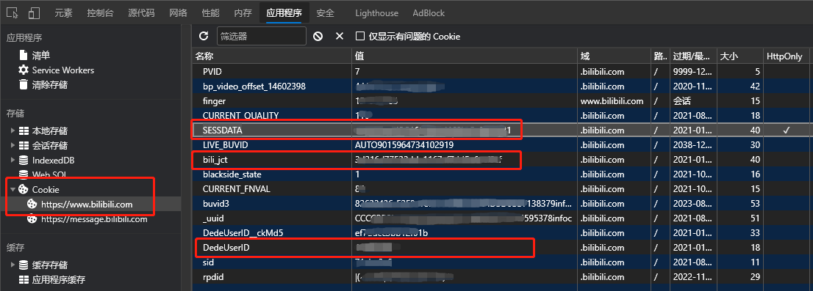
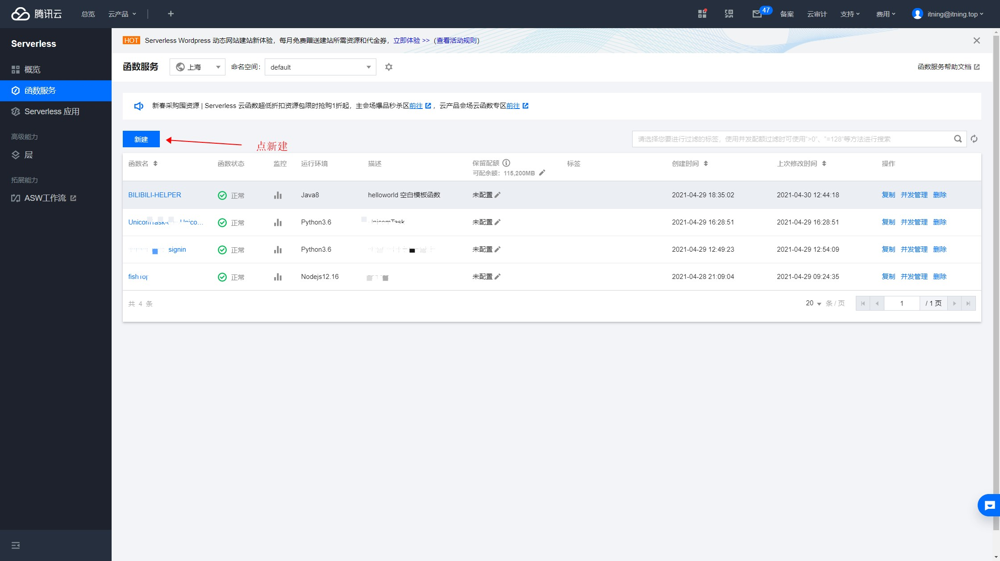
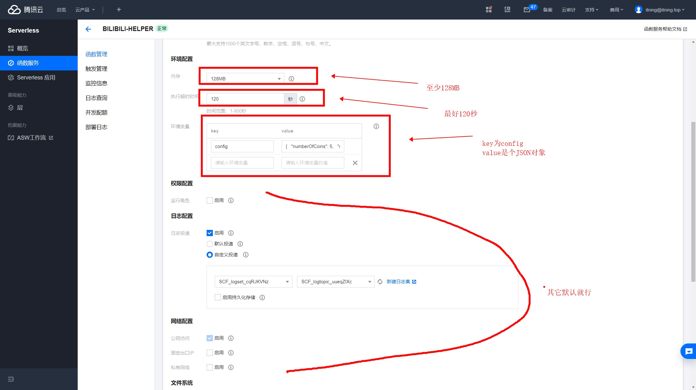
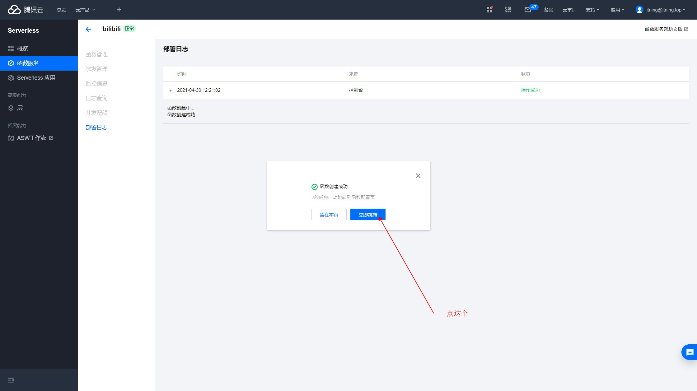
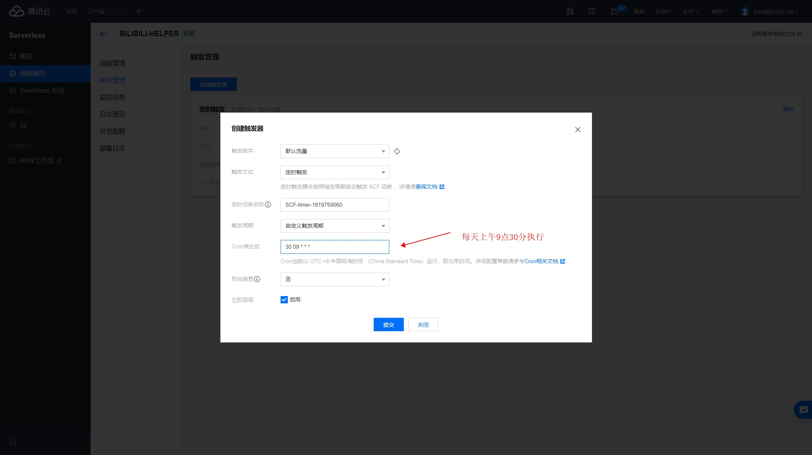
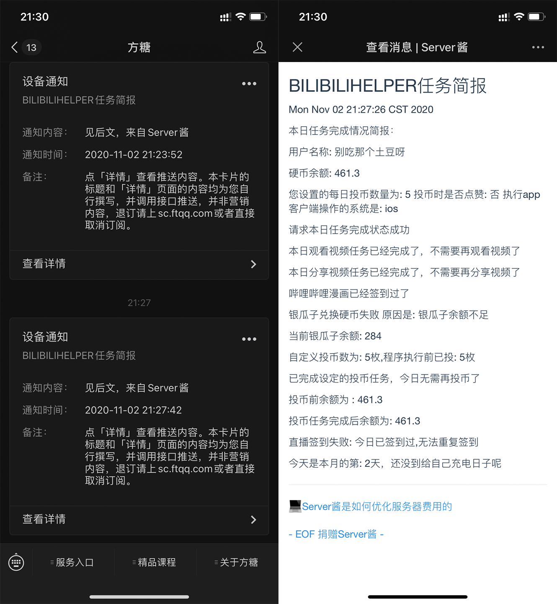

<div align="center">
<h1 align="center">
BILIBILI-HELPER-PRE
</h1>

[](https://github.com/JunzhouLiu/BILIBILI-HELPER-PRE/stargazers)
[](https://github.com/JunzhouLiu/BILIBILI-HELPER-PRE/network)
[](https://github.com/JunzhouLiu/BILIBILI-HELPER-PRE/issues)
[](https://github.com/JunzhouLiu/BILIBILI-HELPER-PRE/blob/main/LICENSE)
[](https://github.com/JunzhouLiu/BILIBILI-HELPER-PRE/releases)
[](https://hub.docker.com/r/superng6/bilibili-helper)
[](https://github.com/JunzhouLiu/BILIBILI-HELPER-PRE/graphs/contributors)

[](https://app.fossa.com/projects/git%2Bgithub.com%2FJunzhouLiu%2FBILIBILI-HELPER?ref=badge_shield)

</div>

## 工具简介

原工具被 ban，目测是因为 GitHub actions，正在和 github 沟通，希望能够尽快恢复，本仓库版本移除了对 github actions 的支持。

这是一个利用 Linux Crontab , Docker 等方式实现哔哩哔哩（Bilibili）每日任务投币，点赞，分享视频，直播签到，银瓜子兑换硬币，漫画每日签到，简单配置即可每日轻松获取 65 经验值，快来和我一起成为
Lv6 吧\~\~\~\~

**如果觉得好用，顺手点个 Star 吧 ❤**

**仓库地址：[JunzhouLiu/BILIBILI-HELPER-PRE](https://github.com/JunzhouLiu/BILIBILI-HELPER-PRE)**

**B 站赛事预测助手已发布，每天自动参与 KPL，LPL 赛事预测，赚取硬币。**

**仓库地址：[JunzhouLiu/bilibili-match-prediction](https://github.com/JunzhouLiu/bilibili-match-prediction)**

**请不要滥用相关 API，让我们一起爱护 B 站 ❤**

<div align="center">

[也可点击此处一键加群](https://qm.qq.com/cgi-bin/qm/qr?k=m_M1Fydi3MvrVAEM0Sp6hDfZF4N2SpXU&jump_from=webapi)

qq 群二维码


</div>

## 功能列表

- [x] 每天上午 9 点 10 分自动开始任务。_【运行时间可自定义】_
- [x] 哔哩哔哩漫画每日自动签到，自动阅读 1 章节 。
- [x] 每日自动从热门视频中随机观看 1 个视频，分享一个视频。
- [x] 每日从热门视频中选取 5 个进行智能投币 _【如果投币不能获得经验了，则不会投币】_
- [x] 投币支持下次一定啦，可自定义每日投币数量。_【如果检测到你已经投过币了，则不会投币】_
- [x] 大会员月底使用快到期的 B 币券，给自己充电，一点也不会浪费哦，默认开启。_【已支持给指定 UP 充电】_
- [x] 大会员月初 1 号自动领取每月 5 张 B 币券和福利。
- [x] 每日哔哩哔哩直播自动签到，领取签到奖励。_【直播你可以不看，但是奖励咱们一定要领】_
- [x] Linux 用户支持自定义配置了。
- [x] 投币策略更新可配置投币喜好。_【可配置优先给关注的 up 投币】_
- [x] 自动送出即将过期的礼物。 _【默认开启，未更新到新版本的用户默认关闭】_
- [x] 支持推送执行结果到微信，钉钉，飞书等

[点击快速开始使用](#使用说明)

[点击快速查看自定义功能配置](#自定义功能配置)

# 目录

- [目录](#目录)
  - [使用说明](#使用说明)
    - [获取运行所需的 Cookies](#获取运行所需的-cookies)
    - [一、使用 腾讯云函数](#一使用-腾讯云函数)
    - [二、使用 Docker](#二使用-docker)
    - [三、使用 Linux Crontab 方式](#三使用-linux-crontab-方式)
    - [自定义功能配置](#自定义功能配置)
  - [订阅执行结果](#订阅执行结果)
    - [Server 酱 Turbo 版](#server-酱-turbo-版)
    - [Telegram 订阅执行结果](#telegram-订阅执行结果)
    - [钉钉机器人](#钉钉机器人)
    - [PushPlus(Push+)](#pushpluspush)
  - [更新和帮助](#更新和帮助)
    - [使用 Pull APP［推荐］](#使用-pull-app推荐)
    - [常见问题解答](#常见问题解答)
  - [免责声明](#免责声明)
  - [API 参考列表](#api-参考列表)
  - [基于本项目的衍生项目](#基于本项目的衍生项目)
  - [致谢](#致谢)
  - [License](#license)
  - [Stargazers over time](#stargazers-over-time)

## 使用说明

### 获取运行所需的 Cookies

1. **Fork 本项目**
2. **获取 Bilibili Cookies**
3. 浏览器打开并登录 [bilibili 网站]()
4. 按 F12 打开 「开发者工具」 找到 应用程序/Application -\> 存储 -\> Cookies
5. 找到 `bili_jct` `SESSDATA` `DEDEUSERID` 三项，并复制值，后面需要用到。



**请各位使用 Actions 时务必遵守 Github 条款。不要滥用 Actions 服务。**

**Please be sure to abide by the Github terms when using Actions. Do not abuse the Actions service.**

### 一、使用 腾讯云函数

关于腾讯云 云函数功能开通相关问题 请加群询问。

腾讯云函数地址：[函数服务 - Serverless - 控制台 (tencent.com)](https://console.cloud.tencent.com/scf/list?rid=4&ns=default)

1.新建



2.按照图示填写信息

执行方法：`top.misec.BiliMain::mainHandler`

JAR包获取地址：[Release](https://github.com/JunzhouLiu/BILIBILI-HELPER-PRE/releases)


key:`scfFlag` value:`true`

value配置文件：

```json
{
  "numberOfCoins": 5,
  "reserveCoins": 50,
  "selectLike": 0,
  "monthEndAutoCharge": true,
  "giveGift": true,
  "upLive": "0",
  "chargeForLove": "0",
  "devicePlatform": "ios",
  "coinAddPriority": 1,
  "skipDailyTask": true,
  "userAgent": "Mozilla/5.0 (Macintosh; Intel Mac OS X 10_15_7) AppleWebKit/605.1.15 (KHTML, like Gecko) Version/14.0 Safari/605.1.15",
  "dedeuserid": "",
  "sessdata": "",
  "biliJct": "",
  "telegrambottoken": null,
  "telegramchatid": null,
  "serverpushkey": null
}
```

**dedeuserid sessdata biliJct 必填**

**不使用TG推送请把telegrambottoken和telegramchatid的值改为null（上面示例就是null）**

**不推送请把serverpushkey值改为null（上面示例就是null）**

例子：

```json
{
  "numberOfCoins": 5,
  "reserveCoins": 50,
  "selectLike": 0,
  "monthEndAutoCharge": true,
  "giveGift": true,
  "upLive": "0",
  "chargeForLove": "0",
  "devicePlatform": "ios",
  "coinAddPriority": 1,
  "skipDailyTask": true,
  "userAgent": "Mozilla/5.0 (Macintosh; Intel Mac OS X 10_15_7) AppleWebKit/605.1.15 (KHTML, like Gecko) Version/14.0 Safari/605.1.15",
  "dedeuserid": "",
  "sessdata": "",
  "biliJct": "",
  "telegrambottoken": null,
  "telegramchatid": null,
  "serverpushkey": "https://oapi.dingtalk.com/robot/send?access_token=XXX"
}
```
SERVER酱：
```json
{
  "numberOfCoins": 5,
  "reserveCoins": 50,
  "selectLike": 0,
  "monthEndAutoCharge": true,
  "giveGift": true,
  "upLive": "0",
  "chargeForLove": "0",
  "devicePlatform": "ios",
  "coinAddPriority": 1,
  "skipDailyTask": true,
  "userAgent": "Mozilla/5.0 (Macintosh; Intel Mac OS X 10_15_7) AppleWebKit/605.1.15 (KHTML, like Gecko) Version/14.0 Safari/605.1.15",
  "dedeuserid": "",
  "sessdata": "",
  "biliJct": "",
  "telegrambottoken": null,
  "telegramchatid": null,
  "serverpushkey": "申请的KEY"
}
```

[具体推送配置请点这](#订阅执行结果)

**日志配置 不需要像下边图里一样，直接默认就行**



3.点完成后，再点击立即跳转



4.创建个触发器

点 触发管理->创建触发器

CRON表达式：`30 09 * * *`



5.完成

### 二、使用 Docker

请自行参阅 [Issues/75#issuecomment-731705657][28] 和[基于本项目的衍生项目](#基于本项目的衍生项目)。

[28]: https://github.com/JunzhouLiu/BILIBILI-HELPER/issues/75#issuecomment-731705657

### 三、使用 Linux Crontab 方式

1. 在 linux shell 环境执行以下命令，并按照提示输入 SESSDATA，DEDEUSERID，BILI_JCT，SCKEY 四个参数

```
wget https://raw.githubusercontent.com/JunzhouLiu/BILIBILI-HELPER-PRE/main/setup.sh && chmod +x ./setup.sh && sudo ./setup.sh
```

**ps：注意，如果使用自定义配置，请将`config.json`和 jar 包放置在同一目录(使用 setup.sh 安装则需要将`config.json`放置到`{HOME}/BILIBILI-HELPER`)，`v1.2.2`
之后的版本`release`中都会携带一份`config.json`。**

2. 除此之外，也可以通过点击 [BILIBILI-HELPER-PRE/release][30]，下载已发布的版本，解压后将 jar 包手动上传到 Linux 服务器，使用 crontab 完成定时执行，如果使用`crontab`
   请记得`source /etc/profile`和`source ~/.bashrc`,建议直接使用仓库提供的[`start.sh`][31]脚本,注意修改脚本的 jar 包路径和 cookies 参数。

[30]: https://github.com/JunzhouLiu/BILIBILI-HELPER-PRE/releases/latest
[31]: https://github.com/JunzhouLiu/BILIBILI-HELPER-PRE/blob/main/start.sh

**crontab 命令示例**

`30 10 * * * sh /home/start.sh`

| args              | 说明               |
| ----------------- | ------------------ |
| 30 10 \* \* \*    | `crontab` 定时时间 |
| sh /home/start.sh | `start.sh`的路径   |

```shell
#!/bin/bash
source /etc/profile
source ~/.bashrc
source ~/.zshrc #其他终端请自行引入环境变量
echo $PATH
java -jar /home/BILIBILI-HELPER.jar DEDEUSERID SESSDATA BILI_JCT SCKEY >> /var/log/bilibili-help.log
# 注意将jar包路径替换为实际路径。将参数修改该你自己的参数，cookies中含有等特殊字符需要转义。
```

**命令示例：**

```shell
# *如果Cookies参数中包含特殊字符，例如`%`请使用`\`转义*,如果不执行可在命令前增加 source /etc/profile
# m h  dom mon dow   command
30 10 * * * java -jar /home/BILIBILI-HELP.jar DEDEUSERID SESSDATA BILI_JCT >/var/log/cron.log &
```

### 自定义功能配置

配置文件示例：

```json
{
  "numberOfCoins": 5,
  "reserveCoins": 50,
  "selectLike": 0,
  "monthEndAutoCharge": true,
  "giveGift": true,
  "upLive": "0",
  "chargeForLove": "0",
  "devicePlatform": "ios",
  "coinAddPriority": 1,
  "skipDailyTask": true,
  "userAgent": "Mozilla/5.0 (Macintosh; Intel Mac OS X 10_15_7) AppleWebKit/605.1.15 (KHTML, like Gecko) Version/14.0 Safari/605.1.15"
}
```

**Windows/Linux 用户使用 jar 包时，`release`包中会包含一份`config.json`配置文件，只需将其和`BILIBILI-HELP.jar`放在同一目录即可，执行时优先加载外部配置文件**

配置文件参数示意

| Key                | Value                | 说明                                                                     |
| ------------------ | -------------------- | ------------------------------------------------------------------------ |
| numberOfCoins      | [0,5]                | 每日投币数量,默认 5 ,为 0 时则不投币                                     |
| reserveCoins       | [0,4000]             | 预留的硬币数，当硬币余额小于这个值时，不会进行投币任务，默认值为 50      |
| selectLike         | [0,1]                | 投币时是否点赞，默认 0, 0：否 1：是                                      |
| monthEndAutoCharge | [false,true]         | 年度大会员月底是否用 B 币券给自己充电，默认 `true`，即充电对象是你本人。 |
| giveGift           | [false,true]         | 直播送出即将过期的礼物，默认开启，如需关闭请改为 false                   |
| upLive             | [0,送礼 up 主的 uid] | 直播送出即将过期的礼物，指定 up 主，为 0 时则随随机选取一个 up 主        |
| chargeForLove      | [0,充电对象的 uid]   | 给指定 up 主充电，值为 0 或者充电对象的 uid，默认为 0，即给自己充电。    |
| devicePlatform     | [ios,android]        | 手机端漫画签到时的平台，建议选择你设备的平台 ，默认 `ios`                |
| coinAddPriority    | [0,1]                | 0：优先给热榜视频投币，1：优先给关注的 up 投币                           |
| userAgent          | 浏览器 UA            | 用户可根据部署平台配置，可根据 userAgent 参数列表自由选取                |
| skipDailyTask      | [false,true]         | 是否跳过每日任务，默认`true`,如果关闭跳过每日任务，请改为`false`         |

**tips:如果你没有上传过视频并开启充电计划，充电会失败，B 币券会浪费。此时建议配置为给指定的 up 主充电。欢迎给即将秃头的我充电 uid：[14602398][32] **

[32]: https://space.bilibili.com/14602398

userAgent 可选参数列表

| 平台      | 浏览器         | userAgent                                                                                                                           |
| --------- | -------------- | ----------------------------------------------------------------------------------------------------------------------------------- |
| Windows10 | EDGE(chromium) | Mozilla/5.0 (Windows NT 10.0; Win64; x64) AppleWebKit/537.36 (KHTML, like Gecko) Chrome/86.0.4240.198 Safari/537.36 Edg/86.0.622.69 |
| Windows10 | Chrome         | Mozilla/5.0 (Windows NT 10.0; Win64; x64) AppleWebKit/537.36 (KHTML, like Gecko) Chrome/86.0.4240.198 Safari/537.36                 |
| masOS     | safari         | Mozilla/5.0 (Macintosh; Intel Mac OS X 10_15_7) AppleWebKit/605.1.15 (KHTML, like Gecko) Version/14.0 Safari/605.1.15               |
| macOS     | Firefox        | Mozilla/5.0 (Macintosh; Intel Mac OS X 10.12; rv:65.0) Gecko/20100101 Firefox/65.0                                                  |
| macOS     | Chrome         | Mozilla/5.0 (Macintosh; Intel Mac OS X 10_12_6) AppleWebKit/537.36 (KHTML, like Gecko) Chrome/73.0.3683.75 Safari/537.36            |

_ps：如果尝试给关注的 up 投币十次后（保不准你关注的是年更 up 主），还没完成每日投币任务，则切换成热榜模式，给热榜视频投币_

_投币数量代码做了处理，如果本日投币不能获得经验了，则不会投币，每天只投能获得经验的硬币。假设你设置每日投币 3 个，早上 7 点你自己投了 2 个硬币，则十点半时，程序只会投 1 个）_
tips:从1.4.1版本开始，随机视频投币有一定的概率会将硬币投给本项目的核心开发者，算是对核心开发者长期以来维护的回馈。
## 订阅执行结果

### Server 酱 Turbo 版

目前 Turbo 版本的消息通道支持以下渠道

- 企业微信应用消息
- Android，
- Bark iOS，
- 企业微信群机器人
- 钉钉群机器人
- 飞书群机器人
- 自定义微信测试号
- 方糖服务号

1. 前往 [sct.ftqq.com](https://sct.ftqq.com/sendkey)点击登入，创建账号。
2. 点击点[SendKey](https://sct.ftqq.com/sendkey) ，生成一个 Key。将其增加到 Github Secrets 中，变量名为 `SERVERPUSHKEY`
3. [配置消息通道](https://sct.ftqq.com/forward) ，选择方糖服务号，保存即可。
4. 推送效果展示
   

**
旧版推送渠道[sc.ftqq.com](http://sc.ftqq.com/9.version0) 即将与 4 月底下线，请前往[sct.ftqq.com](https://sct.ftqq.com/sendkey)生成`Turbo`版本的`Key`，注意，申请 Turbo 版 Key 后请配置消息通道，如果想沿用以前的推送方式，选择方糖服务号即可**

### Telegram 订阅执行结果

1.在 Telegram 中添加 BotFather 这个账号，然后依次发送/start /newbot 按照提示即可创建一个新的机器人。记下来给你生成的 token。

2.搜索刚刚创建的机器人的名字，并给它发送一条消息。

_特别注意：需要先与机器人之间创建会话，机器人才能下发消息，否则机器人无法主动发送消息，切记！_

3.在 Telegram 中搜索 userinfobot，并给它发送一条消息，它会返回给你 chatid。

4.在 Github Secrets 中删除 SERVERPUSHKEY，添加 TELEGRAMBOTTOKEN，TELEGRAMCHATID。

### 钉钉机器人

1.首先你得有个钉钉企业 [快速注册](https://oa.dingtalk.com/register.html)

2.[进入钉钉开放平台添加机器人](https://open-dev.dingtalk.com/#/corprobot)

3.添加自定义关键词：BILIBILI

4.在 Github Secrets 中的 SERVERPUSHKEY 中更新成机器人的 Webhook

例如:`https://oapi.dingtalk.com/robot/send?access_token=XXX`

5.完成

### PushPlus(Push+)

1.[前往 PushPlus 获取 Token](https://www.pushplus.plus/push1.html)

2.在 Github Secrets 中的 SERVERPUSHKEY 中更新成获取到的 Token

3.完成

## 更新和帮助

### 使用 Pull APP［推荐］

参阅 [Pull APP](https://github.com/apps/pull)

### 常见问题解答

## 免责声明

1. 本工具不会记录你的任何敏感信息，也不会上传到任何服务器上。（例如用户的 cookies 数据，cookies 数据均存在 Actions Secrets 中或者用户自己的设备上）
2. 本工具不会记录任何执行过程中来自 b 站的数据信息，也不会上传到任何服务器上。（例如 av 号，bv 号，用户 uid 等）。
3. 本工具执行过程中产生的日志，仅会在使用者自行配置推送渠道后进行推送。日志中不包含任何用户敏感信息。
4. 如果有人修改了本项目（或者直接使用本项目）盈利恰饭，那和我肯定没关系，我开源的目的单纯是技术分享。
5. 如果你使用了第三方修改的，打包的本工具代码，那你可得注意了，指不定人就把你的数据上传到他自己的服务器了，这可和我没关系。（**网络安全教育普及任重而道远**）
6. 本工具源码仅在[JunzhouLiu/BILIBILI-HELPER-PRE](https://github.com/JunzhouLiu/BILIBILI-HELPER-PRE)开源，其余的地方的代码均不是我提交的，可能是抄我的，借鉴我的，但绝对不是我发布的，出问题和我也没关系。
7. 我开源本工具的代码仅仅是技术分享，没有任何丝毫的盈利赚钱目的，如果你非要给我打赏/充电，那我就是网络乞丐，咱们不构成任何雇佣，购买关系的交易。
8. 本项目不会增加类似于自动转发抽奖，秒杀，下载版权受限视频等侵犯 UP 主/B 站权益的功能，开发这个应用的目的是单纯的技术分享。下游分支开发者/使用者也请不要滥用相关功能。
9. 本项目欢迎其他开发者参与贡献，基于本工具的二次开发，使用其他语言重写都没有什么问题，能在技术上给你带来帮助和收获就很好.
10. 本项目遵守[MIT License](https://github.com/JunzhouLiu/BILIBILI-HELPER-PRE/blob/main/LICENSE)，请各位知悉。

## API 参考列表

- [SocialSisterYi/bilibili-API-collect](https://github.com/SocialSisterYi/bilibili-API-collect)
- [happy888888/BiliExp](https://github.com/happy888888/BiliExp)

## 基于本项目的衍生项目

- **基于本项目的 docker 封装项目：[SuperNG6/docker-bilibili-helper](https://github.com/SuperNG6/docker-bilibili-helper)**

- **基于本项目的 docker 镜像：[superng6/bilibili-helper](https://hub.docker.com/r/superng6/bilibili-helper)**

- **基于本项目的 runer 项目：[KurenaiRyu/bilibili-helper-runer](https://github.com/KurenaiRyu/bilibili-helper-runer)**

- **基于本项目的 k8s 项目：[yangyang0507/k8s-bilibili-helper](https://github.com/yangyang0507/k8s-bilibili-helper)**

## 致谢

感谢 JetBrains 对本项目的支持。

[](https://www.jetbrains.com/?from=BILIBILI-HELPER)

## License

[](https://app.fossa.com/projects/git%2Bgithub.com%2FJunzhouLiu%2FBILIBILI-HELPER?ref=badge_large)

## Stargazers over time

[](https://starchart.cc/JunzhouLiu/BILIBILI-HELPER-PRE)
