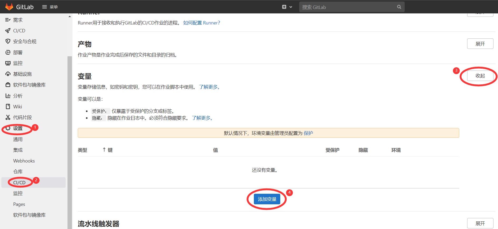
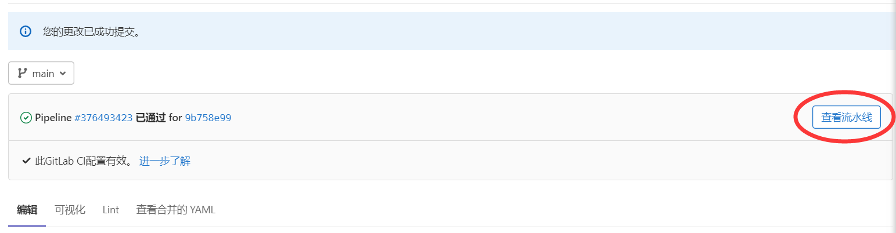

## 使用 GitLab CI/CD 部署教程

### 1. 创建仓库

如果你还没有GitLab账号请先注册。

首先访问GitLab，[创建一个空白项目](https://gitlab.com/projects/new#blank_project)。（公开或私有都可）

### 2. 变量配置


在你刚刚创建的空白项目页面中，依次按上图序号点击，进行变量的配置。

环境变量：

|      key      | 必须 |                                         value                                           |
| ------------- | ---- | --------------------------------------------------------------------------------------- |
|   `CONFIG`    |  是  | `复制下方完整的config样例，填好对应的值，直接复制粘贴即可，值的具体含义可在项目READEME查看。`  |
|   `VERSION`   |  否  | `不填或空自动使用最新发布版本；如指定，则填写对应tag号；如使用仓库中最新commit，请填写latest。` |
|  `USE_MAVEN`  |  否  | `值为TRUE时强制每次都打包；其他值或不填首先会尝试从GitHub仓库release中下载zip包，失败则打包。` |
| `REPO_SOURCE` |  否  | `必为GitHub仓库，不填或空默认为本仓库（JunzhouLiu/BILIBILI-HELPER-PRE）,格式为 ID/仓库名。`  |

**config 样例**

```json
{
  "biliVerify": {
    "biliCookies": "你的bilibili cookies，完整的cookies获取方法见项目README"
  },
  "taskConfig": {
    "skipDailyTask": false,
    "matchGame": false,
    "showHandModel": false,
    "predictNumberOfCoins": 1,
    "minimumNumberOfCoins": 100,
    "taskIntervalTime": 20,
    "numberOfCoins": 5,
    "reserveCoins": 10,
    "selectLike": 0,
    "monthEndAutoCharge": true,
    "giveGift": true,
    "silver2Coin": true,
    "upLive": "0",
    "chargeForLove": "14602398",
    "chargeDay": 28,
    "devicePlatform": "ios",
    "coinAddPriority": 1,
    "userAgent": "你的默认UA"
  },
  "pushConfig": {
    "SC_KEY": "",
    "SCT_KEY": "",
    "TG_BOT_TOKEN": "",
    "TG_USER_ID": "",
    "TG_USE_CUSTOM_URL": false,
    "DING_TALK_URL": "",
    "DING_TALK_SECRET": "",
    "PUSH_PLUS_TOKEN": "",
    "WE_COM_GROUP_TOKEN": "",
    "WE_COM_APP_CORPID": "",
    "WE_COM_APP_CORP_SECRET": "",
    "WE_COM_APP_AGENT_ID": 0,
    "WE_COM_APP_TO_USER": "",
    "WE_COM_APP_MEDIA_ID": "",
    "PROXY_HTTP_HOST": "",
    "PROXY_SOCKET_HOST": "",
    "PROXY_PORT": 0
  }
}
```

**如果不知道自己的 UA 之类数据，以及看不懂每个值的含义，可以[点击进入配置自动生成页面](https://utils.misec.top/index) 此页面暂不支持生成 v2.0.0 的配置**


完成后界面如下图所示：


### 3. 配置 CI/CD 流水线


依次按上图序号点击，创建一个新的 CI/CD 流水线。

如果你希望 CI/CD 流水线内容始终跟随[上游](https://github.com/JunzhouLiu/BILIBILI-HELPER-PRE)，直接将以下内容复制覆盖粘贴到编辑器中。

```yaml
include:
  - remote: 'https://github.com/JunzhouLiu/BILIBILI-HELPER-PRE/raw/main/.gitlab-ci.yml'
```

如果你希望自定义 CI/CD 流水线，可以将本仓库中[.gitlab-ci.yml](https://github.com/JunzhouLiu/BILIBILI-HELPER-PRE/blob/main/.gitlab-ci.yml)文件内容复制覆盖粘贴到编辑器中，随后自定义。

确保编辑后的工作流显示`此GitLab CI配置有效`，随后点击页面下方`提交更改`。

之后会提示`您的更改已成功提交`，并自动触发一次流水线运行，你可以点击`查看流水线`查询流水线运行日志。



最终流水线提示`已通过`，并一切按配置正常工作，则成功。否则请检查上述操作中是否有疏漏之处。

### 4. 配置定时运行


依次按上图序号点击，创建一个新的流水线计划。

随后按下图说明创建：


创建成功，可查看你刚刚配置完成的流水线计划，下一次运行的时间等。点击右方最左边▶️按钮还可以立即触发一次流水线运行。


