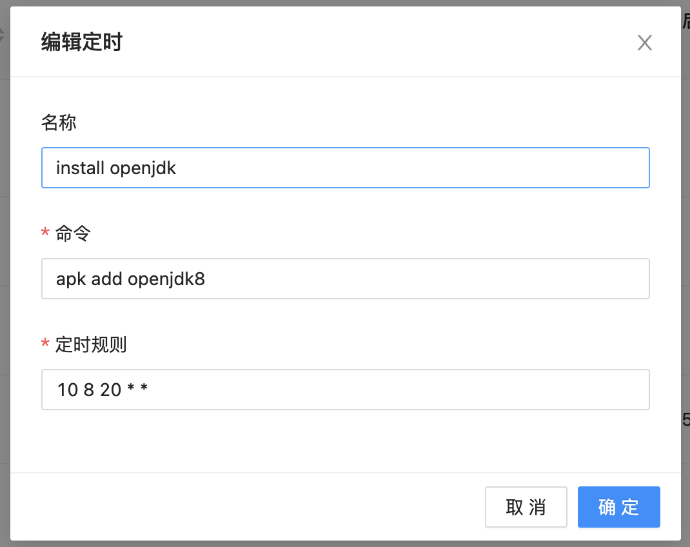
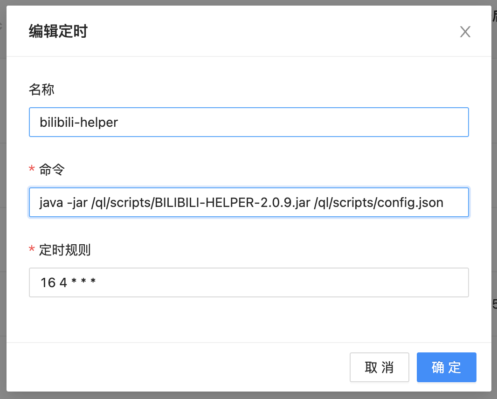

## 青龙使用教程

感谢[issues/51](https://github.com/JunzhouLiu/BILIBILI-HELPER-PRE/issues/51) @graytoowolf 提供的方案。

### 下载 Release 包备用

点击[Release](https://github.com/JunzhouLiu/BILIBILI-HELPER-PRE/releases/)，下载名称为`BILIBILI-HELPER-v2.x.x.zip`的 zip 压缩包到本地，解压后备用。

ps:只需要`BILIBILI-HELPER-v2.x.x.jar`和`config.json`这两个文件。

### 在青龙中安装 openjdk

新建一个定时任务，并执行。此任务可执行完可删除。



- **任务名：** install openjdk

- **命令：** `apk add openjdk8`

- **定时：** `10 8 20 * *`

### 上传文件

将`BILIBILI-HELPER-v2.x.x.jar`和填写好的`config.json`这两个文件放到 `/ql/scripts`目录（物理机放到容器此目录对应的映射目录即可）。

### 创建海尔破定时任务



- **任务名：** 运行海尔破

- **命令：** `java -jar /ql/scripts/BILIBILI-HELPER-2.0.9.jar /ql/scripts/config.json`

- **定时：** `10 8 * * *`

如果`/ql/scripts`目录已经存在`config.json` 文件，可将 config.json 改名，在执行命令后指定对应的文件即可。

例如将`config.json`改名为`bilibili.json`，对应的执行命令则是`java -jar /ql/scripts/BILIBILI-HELPER-v2.0.9.jar /ql/scripts/bilibili.json`

### 日志查看

**如果需要查看日志请在青龙管理面板-任务日志找到 java 目录查看执行日志**

如果需要运行时查看日志请创建一个`bili.sh`脚本，放置到`/ql/scrpts `目录，并将定时任务的执行命令修改为 `task bili.sh`即可，请将 sh 文件中路径，文件名改为你实际的路径文件名（均为容器内的路径）。

```sh
#!/usr/bin/env bash
java -jar /ql/scripts/BILIBILI-HELPER-v2.0.9.jar /ql/scripts/config.json`
```
