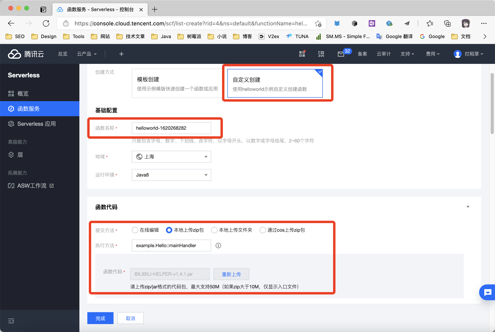
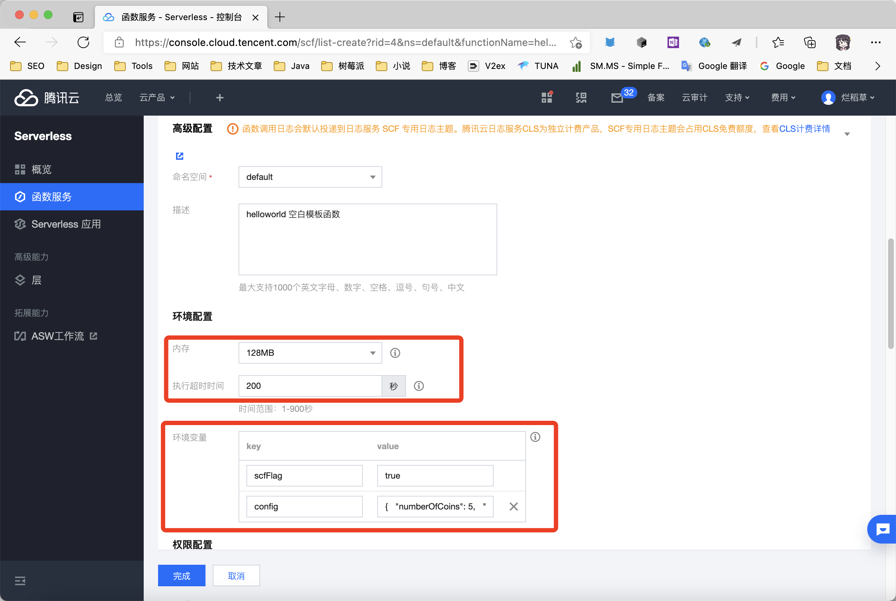
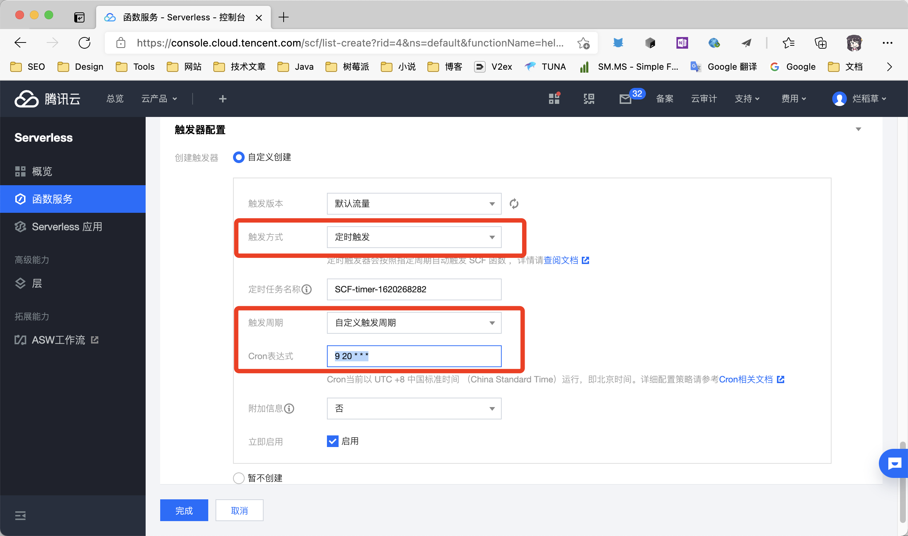
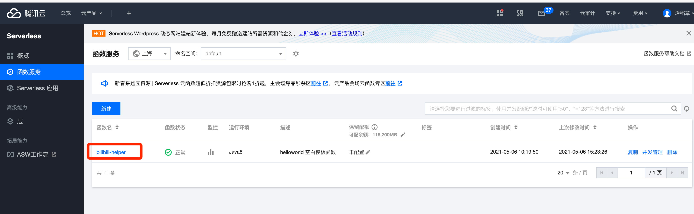

## 腾讯云函数使用教程

###
关于腾讯云，云函数功能开通相关问题，请加群询问。

腾讯云函数开通地址：[函数服务 - Serverless - 控制台 (tencent.com)](https://console.cloud.tencent.com/scf/list?rid=4&ns=default)

### 1. 下载release包备用

点击[Release](https://github.com/JunzhouLiu/BILIBILI-HELPER-PRE/releases/)，下载名称为`BILIBILI-HELPER-v1.x.x.zip`的zip包到本地，解压后备用。

### 2. 配置云函数


点击新建按钮，新建一个云函数，选择自定义创建，并填写以下信息：



#### 基础配置
**函数名称：** bilibili-heler（可自定义）。 

**地域：** 自选，如果需要tg推送，请选香港。 
 
**运行环境：** Java8 

#### 函数代码配置

**提交方法：** 本地上传zip包。

**执行方法：** `top.misec.BiliMain::mainHandler`

**函数代码：** 上传1中下载好并解压出来的jar包。

#### 高级配置

**命名空间：** 默认

**描述：** 默认，可修改，也可以不改。

#### 环境配置



**内存：** 建议不低于128MB

**执行超时时间：** 建议不低于200s

环境变量：

|  key   | value  |
|  ----  | ----  |
| `scfFlag`  |`true` |
| `config`  | `参照样例` |

**config value样例**

**dedeuserid sessdata biliJct 必填 获取方式见项目README**

```json
{
  "numberOfCoins": 5,
  "reserveCoins": 50,
  "selectLike": 0,
  "monthEndAutoCharge": true,
  "giveGift": true,
  "upLive": "0",
  "chargeForLove": "0",
  "devicePlatform": "ios",
  "coinAddPriority": 1,
  "skipDailyTask": false,
  "userAgent": "Mozilla/5.0 (Macintosh; Intel Mac OS X 10_15_7) AppleWebKit/605.1.15 (KHTML, like Gecko) Version/14.0 Safari/605.1.15",
  "dedeuserid": "",
  "sessdata": "",
  "biliJct": "",
  "telegrambottoken": null,
  "telegramchatid": null,
  "serverpushkey": null
}
```

样例1:使用TGbot推送,如果不使用tgbot请将`telegrambottoken`和`telegramchatid`的值改为null。

```json
{
  "numberOfCoins": 5,
  "reserveCoins": 50,
  "selectLike": 0,
  "monthEndAutoCharge": true,
  "giveGift": true,
  "upLive": "0",
  "chargeForLove": "0",
  "devicePlatform": "ios",
  "coinAddPriority": 1,
  "skipDailyTask": false,
  "userAgent": "Mozilla/5.0 (Macintosh; Intel Mac OS X 10_15_7) AppleWebKit/605.1.15 (KHTML, like Gecko) Version/14.0 Safari/605.1.15",
  "dedeuserid": "",
  "sessdata": "",
  "biliJct": "",
  "telegrambottoken": "0000000:aaaaaaaa",
  "telegramchatid": 123456,
  "serverpushkey": "https://oapi.dingtalk.com/robot/send?access_token=XXX"
}
```
样例2:使用SERVER酱的配置：

```json
{
  "numberOfCoins": 5,
  "reserveCoins": 50,
  "selectLike": 0,
  "monthEndAutoCharge": true,
  "giveGift": true,
  "upLive": "0",
  "chargeForLove": "0",
  "devicePlatform": "ios",
  "coinAddPriority": 1,
  "skipDailyTask": false,
  "userAgent": "Mozilla/5.0 (Macintosh; Intel Mac OS X 10_15_7) AppleWebKit/605.1.15 (KHTML, like Gecko) Version/14.0 Safari/605.1.15",
  "dedeuserid": "",
  "sessdata": "",
  "biliJct": "",
  "telegrambottoken": null,
  "telegramchatid": null,
  "serverpushkey": "申请的KEY"
}
```
样例3:用于测试的事件模版

```json

```

### 触发器配置



创建触发器选择自定义创建。

**触发方式：** 定时触发

**触发周期：** 自定义

Cron表达式：提供了几个可选的表达式。

```
每天20点09分执行：9 20 * * *  
每天0点10分执行：10 0 * * *  
```

### 更新部署




点击函数列表函数名，进入已创建的函数，点击函数管理。选择函数代码，上传新版本的jar包，点击部署即可。

**如果需要测试jar包，请点击部署后点击测试**
