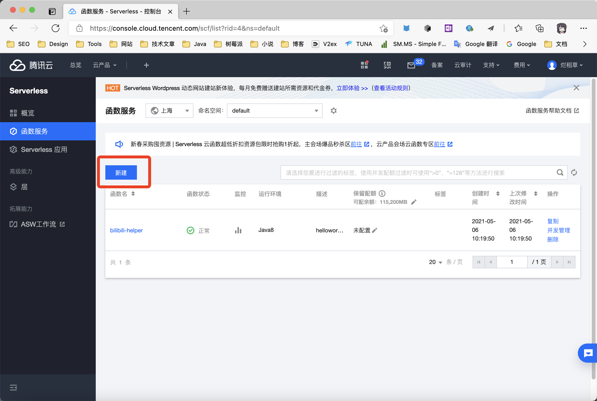
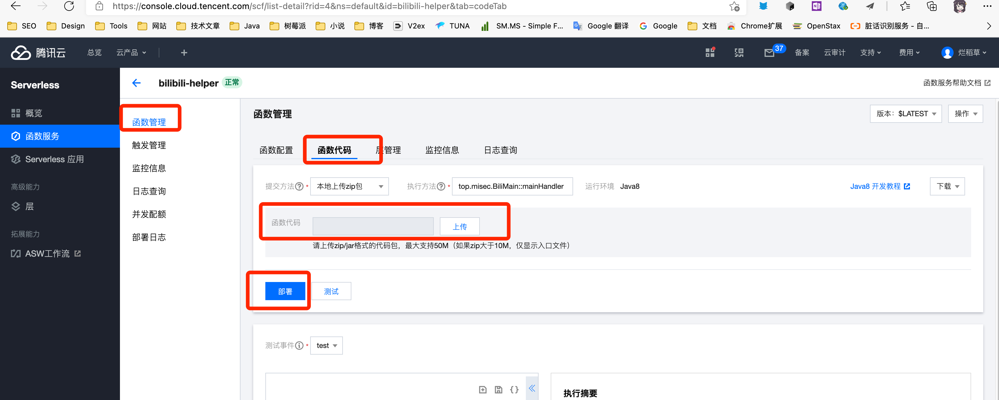

## 腾讯云函数使用教程

## v2.0.0 版本未经过测试，如果有问题，请在 issues 反馈

### 开通云函数

关于腾讯云，云函数功能开通相关问题，请加群询问。

腾讯云函数开通地址：[函数服务 - Serverless - 控制台 (tencent.com)](https://console.cloud.tencent.com/scf/list?rid=4&ns=default)

### 1. 下载 release 包备用

点击[Release](https://github.com/JunzhouLiu/BILIBILI-HELPER-PRE/releases/)，下载名称为`BILIBILI-HELPER-v2.x.x.zip`的 zip 包到本地，解压后备用。

### 2. 配置云函数


点击新建按钮，新建一个云函数，选择自定义创建，并填写以下信息：


#### 基础配置

- **函数名称：** bilibili-heler（可自定义）。

- **地域：** 自选，如果需要 tg 推送，请选香港。

- **运行环境：** Java8

#### 函数代码配置

- **提交方法：** 本地上传 zip 包。

- **执行方法：** `top.misec.BiliMain::mainHandler`

- **函数代码：** 上传 1 中下载好并解压出来的 jar 包。

#### 高级配置

- **命名空间：** 默认

- **描述：** 默认，可修改，也可以不改。

#### 环境配置


- **内存：** 建议不低于 256MB

- **初始化时间** 建议不低于 20s

- **执行超时时间：** 由于任务之间暂停时间较久，建议不低于 600s，如果调整了`taskIntervalTime`,建议按照`taskIntervalTime`的 24 倍填写。

环境变量：

| key      | value                                                                                         |
| -------- | --------------------------------------------------------------------------------------------- |
| `config` | `复制下方完整的config样例，填好对应的值，直接复制粘贴即可，值的具体含义可在项目READEME查看。` |

**config 样例**

```json
{
  "biliVerify": {
    "biliCookies": "你的bilibili cookies，完整的cookies获取方法见项目README"
  },
  "taskConfig": {
    "skipDailyTask": false,
    "matchGame": false,
    "showHandModel": false,
    "predictNumberOfCoins": 1,
    "minimumNumberOfCoins": 100,
    "taskIntervalTime": 20,
    "numberOfCoins": 5,
    "reserveCoins": 10,
    "selectLike": 0,
    "monthEndAutoCharge": true,
    "giveGift": true,
    "silver2Coin": true,
    "upLive": "0",
    "chargeForLove": "14602398",
    "chargeDay": 28,
    "devicePlatform": "ios",
    "coinAddPriority": 1,
    "userAgent": "你的默认UA"
  },
  "pushConfig": {
    "SC_KEY": "",
    "SCT_KEY": "",
    "TG_BOT_TOKEN": "",
    "TG_USER_ID": "",
    "TG_USE_CUSTOM_URL": false,
    "DING_TALK_URL": "",
    "DING_TALK_SECRET": "",
    "PUSH_PLUS_TOKEN": "",
    "WE_COM_GROUP_TOKEN": "",
    "WE_COM_APP_CORPID": "",
    "WE_COM_APP_CORP_SECRET": "",
    "WE_COM_APP_AGENT_ID": 0,
    "WE_COM_APP_TO_USER": "",
    "WE_COM_APP_MEDIA_ID": "",
    "PROXY_HTTP_HOST": "",
    "PROXY_SOCKET_HOST": "",
    "PROXY_PORT": 0
  }
}
```

**如果不知道自己的 UA 之类数据，以及看不懂每个值的含义，可以[点击进入配置自动生成页面](https://utils.misec.top/index) 此页面暂不支持生成 v2.0.0 的配置**

### 触发器配置


创建触发器选择自定义创建。

- **触发方式：** 定时触发

- **触发周期：** 自定义

- **Cron 表达式：** 提供了几个可选的表达式。

```
每天20点09分执行：9 20 * * *
每天0点10分执行：10 0 * * *
```

### 更新部署




点击函数列表函数名，进入已创建的函数，点击函数管理。选择函数代码，上传新版本的 jar 包，点击部署即可。

### 测试

**如果需要测试 jar 包，请点击部署后点击测试。下面提供了一个可用的测试事件模版，方便你在测试的时候变更配置，配置好这个 json，复制粘贴到测试事件中即可。**

```json
{
  "config": {
    "biliVerify": {
      "biliCookies": "你的 bilibili cookies"
    },
    "taskConfig": {
      "skipDailyTask": false,
      "matchGame": false,
      "showHandModel": false,
      "predictNumberOfCoins": 1,
      "minimumNumberOfCoins": 100,
      "taskIntervalTime": 20,
      "numberOfCoins": 5,
      "reserveCoins": 10,
      "selectLike": 0,
      "monthEndAutoCharge": true,
      "giveGift": true,
      "silver2Coin": true,
      "upLive": "0",
      "chargeForLove": "14602398",
      "chargeDay": 28,
      "devicePlatform": "ios",
      "coinAddPriority": 1,
      "userAgent": "你的默认UA"
    },
    "pushConfig": {
      "SC_KEY": "",
      "SCT_KEY": "",
      "TG_BOT_TOKEN": "",
      "TG_USER_ID": "",
      "TG_USE_CUSTOM_URL": false,
      "DING_TALK_URL": "",
      "DING_TALK_SECRET": "",
      "PUSH_PLUS_TOKEN": "",
      "WE_COM_GROUP_TOKEN": "",
      "WE_COM_APP_CORPID": "",
      "WE_COM_APP_CORP_SECRET": "",
      "WE_COM_APP_AGENT_ID": 0,
      "WE_COM_APP_TO_USER": "",
      "WE_COM_APP_MEDIA_ID": "",
      "PROXY_HTTP_HOST": "",
      "PROXY_SOCKET_HOST": "",
      "PROXY_PORT": 0
    }
  }
}
```
